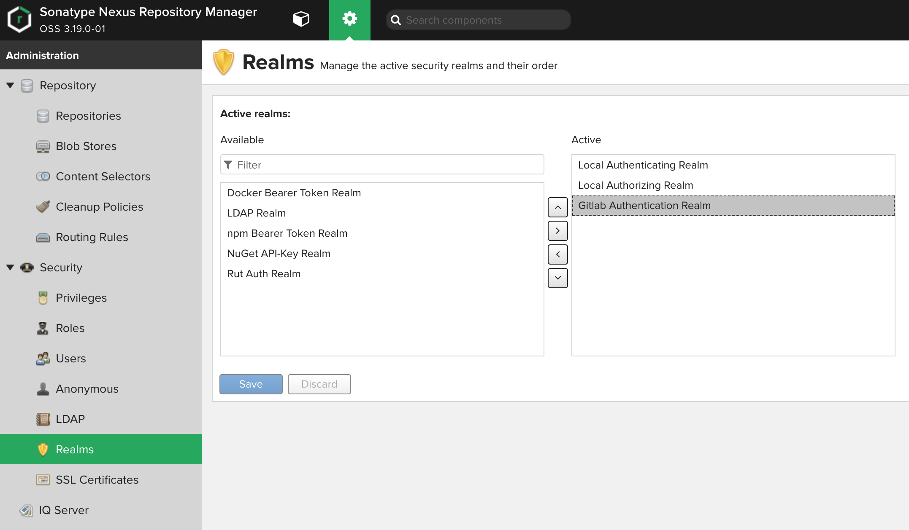

# Nexus3 Gitlab Auth Plugin
This plugin adds a Gitlab realm to Sonatype Nexus OSS and enables you to authenticate with Gitlab Users and authorize with Nexus Roles.

The plugin does not implement a full OAuth flow, instead you use your gitlab user name + an gitlab read_user token you generated in your account to log in to the nexus.
This works through the web as well as through tools like maven, gradle etc.

## Setup

#### Activate the Realm
Log in to your nexus and go to _Administration > Security > Realms_. Move the Gitlab Realm to the right. The realm order in the form determines the order of the realms in your authentication flow. 
We recommend putting Gitlab _after_ the built-in realms:



## Usage

The following steps need to be done by every developer who wants to login to your nexus with Gitlab.
#### 1. Generate API Token

In your Gitlab account under generate a new token with read_user privilege. 

#### 2. Login to nexus

When logging in to nexus, use your gitlab user name as the username and the token you just generated as the password.
This also works through maven, gradle etc.

## Installation

#### 0. Prerequisites

##### Directory naming convention:
For the following commands we assume your nexus installation resides in `/opt/sonatype/nexus`. See [https://books.sonatype.com/nexus-book/reference3/install.html#directories](https://books.sonatype.com/nexus-book/reference3/install.html#directories) for reference.

#### 1. Download and install

The following lines will:
- create a directory in the `nexus` / `kafka` maven repository
- download the latest release from gitlab
- unzip the releae to the maven repository
- add the plugin to the `karaf` `startup.properties`.
```shell
mkdir -p /opt/sonatype/nexus/system/fr/auchan/ &&\
wget -O /opt/sonatype/nexus/system/fr/auchan/nexus3-gitlabauth-plugin-1.1.1.jar https://github.com/auchanretailfrance/nexus3-gitlabauth-plugin/releases/download/1.1.0/nexus3-gitlabauth-plugin-1.1.0.jar &&\
echo "mvn\:fr.auchan/nexus3-gitlabauth-plugin/1.1.1 = 200" >> /opt/sonatype/nexus/etc/karaf/startup.properties
```

#### 2. Create configuration
Create `/opt/sonatype/nexus/etc/gitlabauth.properties`

Within the file you can configure the following properties:

|Property        |Description                              |[Default](https://github.com/larscheid-schmitzhermes/nexus3-gitlabauth-plugin/blob/master/src/main/java/fr/auchan/nexus3/github/oauth/plugin/configuration/GithubOauthConfiguration.java)|
|---             |---                                      |---    |
|`gitlab.api.url`|URL of the Gitlab API to operate against.|`https://gitlab.com`|
|`nexus.defaultRoles`|The roles that all authenticated users are placed in.|
|`gitlab.principal.cache.ttl`|[Java Duration](https://docs.oracle.com/javase/8/docs/api/java/time/Duration.html#parse-java.lang.CharSequence-) for how long a given Access will be cached for. This is a tradeoff of how quickly access can be revoked and how quickly a Gitlab API will be called!|`PT1M` (1 Minute)|----|

This is what an example file would look like:
```properties
gitlab.api.url=https://gitlab.com
nexus.defaultRoles=maven-deploy
gitlab.principal.cache.ttl=PT1M
```

#### 3. Restart Nexus
Restart your Nexus instance to let it pick up your changes.

## Development
You can build the project with the integrated maven wrapper like so: `./mvnw clean package`

You can also build locally using Docker by running `docker run --rm -it -v $(pwd):/data -w /data maven:3.5.2 mvn clean package`

You can build a ready to run docker image using the [`Dockerfile`](Dockerfile) to quickly spin up a nexus with the plugin already preinstalled.

## Credits

The whole project is heavily influenced by the, [nexus3-github-oauth-plugin](https://github.com/larscheid-schmitzhermes/nexus3-github-oauth-plugin) itself influenced by the [nexus3-crowd-plugin](https://github.com/pingunaut/nexus3-crowd-plugin).